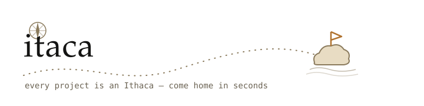

<picture>
  <source media="(prefers-color-scheme: dark)" srcset="assets/banner-dark.svg">
  
</picture>

[](https://www.npmjs.com/package/@itacajs/cli)
[](https://github.com/Lukapetro/itaca/actions/workflows/ci.yml)
[](./LICENSE)

**A local-first registry of every project on your machine, exposed to your coding agents via MCP.**

Switching projects costs you 10–15 minutes of agent context rebuilding, every
time: what is this repo, what stack, which dashboards, where was I? The
information already exists — scattered across package.json, config files and
your own head. itaca derives it, keeps it fresh by construction, and serves it
to any MCP client in a briefing capped at ~600 tokens.

No cloud. No accounts. No telemetry. Your `.env` files are read for pattern
matching only — **values never leave your machine**, and a CI-enforced test
suite keeps it that way.

## Quickstart

```sh
bun add -g @itacajs/cli     # or: bunx @itacajs/cli <command>

itaca scan ~/dev            # one command: every project, stack and service detected
itaca list                  # what's on this machine
itaca context               # "where was I?" — run inside any project
itaca open stockroom        # its dashboards, ready to open in your browser
itaca agent install         # wire up Claude Code: skill + hook + MCP, once
```

After `agent install`, every new Claude Code session starts with the project
briefing preloaded — and your agents can answer *"where was I on tomodachi?"*
without exploring a single file.

## What your agent sees

```
# tomodachi — card exchange platform
Path: /home/you/dev/tomodachi (branch feat/dashi-291, dirty)
Stack: bun · next · typescript
Status: beta — onboarding pilots (updated 2026-08-04)
Next: ship supplier import; fix onboarding drop-off
Services:
  GitHub (code) — https://github.com/you/tomodachi
  Convex (backend) — https://dashboard.convex.dev
  Stripe (payments) — https://dashboard.stripe.com
  ...
Commands: bun run dev · bun run test · bun run typecheck
Other projects: stockroom (beta), everdeep (gate G2), itaca
```

Three MCP tools, nothing more: `projects_list`, `project_get`,
`project_status_update`. The last one closes the loop — agents write a 1–2
line note at the end of a work session into the repo's `itaca.yml`, so the
narrative stays fresh without you maintaining anything.

## How it works

- **The repo is the database.** Stack, services, commands and links are
  re-derived on every scan from what's already in your code — never stale,
  nothing to maintain.
- **`itaca.yml`** holds the only durable state: narrative status, manual
  links, overrides. Committed to git, schema-validated in your editor.
- **Detection is declarative.** Every service is a small YAML rule in
  [rules/](./rules) — Neon, Convex, Cloudflare, Stripe, Polar, Vercel,
  Supabase, Clerk, Resend, Upstash, Turso, Drizzle, Better Auth, Expo,
  PostHog, Sentry, GitHub. Monorepo-aware, workspace-resolving.

```yaml
# rules/neon.yml — a detector is ~10 lines; adding one is a beginner PR
id: neon
service: Neon
category: database
match:
  any:
    - env_value: "\\.neon\\.tech"
    - dep: "@neondatabase/serverless"
links:
  - title: Neon Console
    url: "https://console.neon.tech"
```

Missing your service? [Contributing a rule](./CONTRIBUTING.md) takes ten
minutes.

## For humans too

`itaca open <project>` replaces the bookmark folders you never maintain.
`itaca list` is the machine-wide overview. And the session log your agents
write becomes, a month in, the story of every project — committed in git,
readable by you.

## Status

**Alpha, used daily by its author.** CLI + MCP surface are stable; a local
dashboard (`itaca serve`) is planned. Design doc: [SPEC.md](./SPEC.md).

## License

[MIT](./LICENSE)
